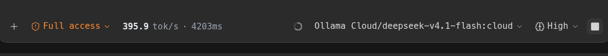
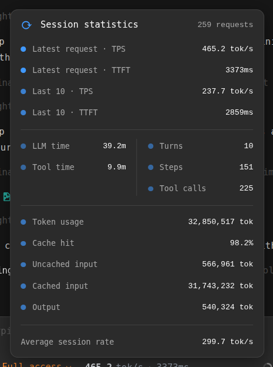
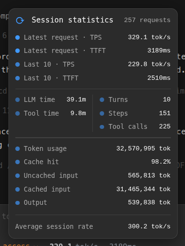
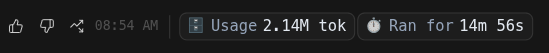
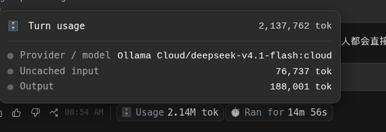

# ViX3L ZCode Tools

[](#license)

A small plugin marketplace for **ZCode Desktop**. It ships two independently installable plugins that surface performance data ZCode already records — without touching model traffic, without telemetry, and without leaving your machine.

| Plugin | What it shows | Version |
|---|---|---|
| **stats-composer** — *Session Statistics (TPS/TTFT)* | Tokens per second and time-to-first-token for every model request: an inline pill in the composer toolbar, plus a local dashboard and CLI. | 0.1.13 |
| **usage-context** — *Turn Usage Context* | Per-turn token usage and elapsed time as chips beside each assistant turn's timestamp, with hover panels for the full breakdown. | 0.1.1 |

Both plugins read the usage database ZCode itself writes (`~/.zcode/cli/db/db.sqlite`), opened **read-only**. Stats therefore work identically across every provider ZCode supports — builtin templates, account plans, and custom OpenAI-compatible endpoints — because nothing is sniffed from the wire.

## What it looks like

**stats-composer** — the stats pill sits in the composer toolbar, right after the "+" button, and shows the latest request's rate and first-token latency:



Hovering the pill opens the **Session statistics** card: latest request and windowed averages, session time split, turn/step/tool-call counts, and the token and cache breakdown. The card ships in a roomy layout by default; a **compact** layout is one setting away (see below):

| Wide (default) | Compact |
|---|---|
|  |  |

**usage-context** — each assistant turn's footer carries two chips beside its timestamp, and hovering either one opens the turn's full accounting:





## Install

1. In ZCode, open **Plugin Marketplace → Add → Add Plugin Marketplace** and paste this repository's URL:
   `https://github.com/ViX3L/vix3l-zcode-tools`
2. Open **Personal → ViX3L ZCode Tools**, pick a plugin, and **Install**:
   - **Session Statistics (TPS/TTFT)** — installed as `stats-composer@vix3l-zcode-tools`
   - **Turn Usage Context** — installed as `usage-context@vix3l-zcode-tools` (requires stats-composer to be enabled; it reads that plugin's local server rather than opening its own)
3. Enable or disable each plugin under **Settings → Plugins**.

Working from a clone instead? Point **Add Plugin Marketplace** at the repository root, or at the clone's `plugins/` folder, which carries its own catalog for the local-directory route.

## After installing

| Command | Does |
|---|---|
| `/stats-composer:tps` | Latest request, windowed average, session average |
| `/stats-composer:dashboard` | Opens the live dashboard (also at `http://127.0.0.1:7427/dashboard`) — sortable per-request table with an auto-refresh toggle |
| `/stats-composer:doctor` | Health check: Node, DB schema, sidecar, CDP |
| `/usage-context:usage` | Prints the current session's per-turn figures |

The inline composer pill appears when ZCode exposes a local debugging port — launch once with `zcode --remote-debugging-port=9229`, or use the launcher under `plugins/stats-composer/launcher/`. Without it, the plugins degrade gracefully to the dashboard, the CLI, and an appended stats line; every channel is documented in the plugin skill.

## Settings

Open **Settings → Plugins → (plugin) → Advanced details → Configuration** to change a plugin's options, then click **Save configuration**; they are saved to your ZCode config and picked up without a restart.

| Option | Plugin | Default | Meaning |
|---|---|---|---|
| **Integration mode** | stats-composer | `auto` | `auto` = composer pill when debugging is available, otherwise an appended stats line; `skill` = appended line only; `sidecar` = background server only |
| **Pill position** | stats-composer | `left` | `left` = beside the "+" button; `right` = next to the model selector |
| **Wide session-statistics card** | stats-composer | on | On = the roomier hover card; off = the compact card |
| **Live streaming rate** | stats-composer | on | Interpolate the last completed request's rate while the model is still streaming |
| **Session window size** | stats-composer | `10` | How many recent requests to average |
| **Sidecar port** | stats-composer | `7427` | HTTP port for the local stats server |
| **Show per-turn chips** | usage-context | on | Render the chips at all |
| **Show the "Ran for" chip** | usage-context | on | Also render the elapsed-time chip |
| **stats-composer sidecar port** | usage-context | `7427` | Which stats-composer server to read |

The card layout is also settable by hand: write `{"wideCard": false}` to `~/.zcode/stats-composer/config.json`. The marketplace setting takes precedence when it is set.

## Requirements

- ZCode Desktop.
- Node ≥ 22.5 only if you run the CLI/doctor from a shell. Otherwise no separate Node is needed: hooks and launchers fall back to the Node embedded in ZCode.
- Nothing to configure for data: ZCode creates its usage database the first time you send a message.

## Privacy

Everything runs locally. The stats server binds `127.0.0.1` only, the usage database is opened read-only and never modified, and the plugins make no network requests of their own — no analytics, no accounts, no egress.

## Repository layout

```
marketplace.json        ← catalog ZCode reads when this repo is added by URL
assets/                 ← screenshots used by this README
plugins/
├── marketplace.json    ← catalog for local-directory installs
├── stats-composer/     ← plugin: per-request TPS/TTFT
└── usage-context/      ← plugin: per-turn usage chips
```

## Developed by

[ViX3L](https://github.com/ViX3L). Issues and pull requests are welcome at [ViX3L/vix3l-zcode-tools](https://github.com/ViX3L/vix3l-zcode-tools).

## License

MIT — declared in each plugin's `plugin.json`.
